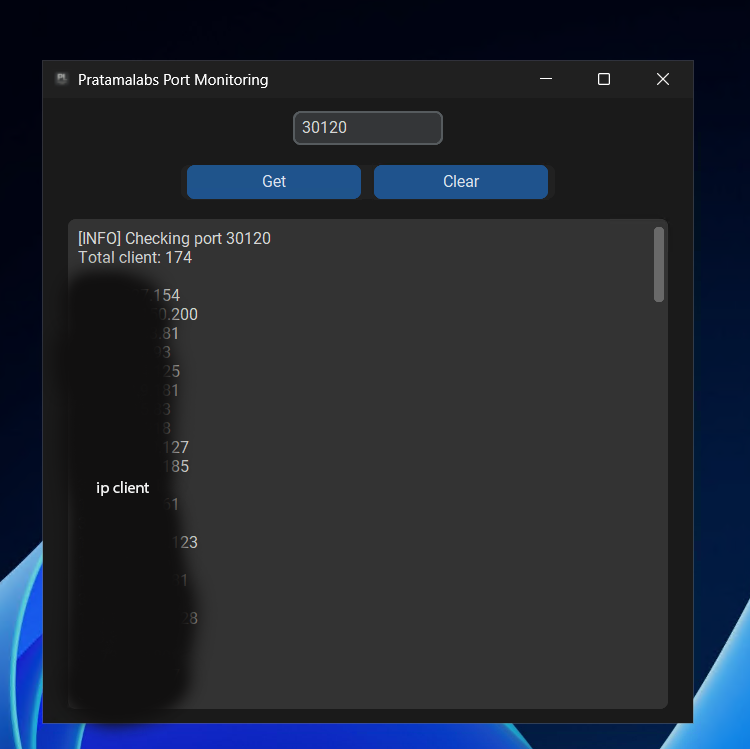

## Documentation

**⚡ Key Features**
- Displays all active client IPs connected to a chosen port.
- Modern dark-themed UI, user-friendly.
- Get button to check a port, Clear button to reset output.
- Real-time information displayed in a textbox, easy to read.
- Run directly as a Windows EXE—no Python installation required.

**✅ Notes**
- Windows only, packaged as an EXE.
- No Python installation needed if using the EXE.
- Make sure your firewall/antivirus allows the app to read network connections.

**Clone and Install Script**

```shell script
git https://github.com/pratamalabs/MonitoringPort
cd MonitoringPort
pip install customtkinter psutil Pillow
python monitoring.py
```